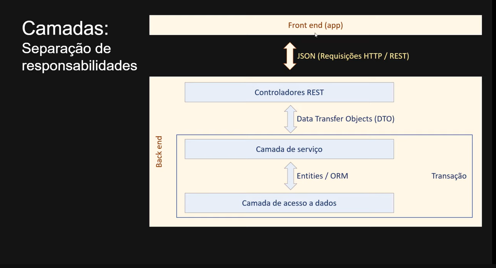

## Camadas ORM - DTO:

#### Pequeno projeto para estudo de camadas, ORM e DTO - com Java e Spring.

##### Camadas:

###### Separação de Responsabilidades:

Uma separação clássica em 3 camadas:

- Camada de Controladores (REST)
- Camada de Serviço
- Camada de acesso á Dados.

Responsabilidade de cada Camada:

- Controlador: Responder interações do usuário.

  - No caso de um API REST, essas 'interações' são as requisições http;

- Service: Realizar operações de negócio
  - Um método da camada SERVICE deve ter um significado relacionado ao negócio, podendo executar várias
    operações. Exemplo: registrarPedido[verificar estoque, salvar pedido, baixar estoque, enviar email]
- Repository: Realizar operações "individuais" de acesso ao banco de dados.

Os objetos que compõem cada uma das camadas, são componentes que executam operações e manipulam dados.

Esses dados manipulados são trafegados entre backend e front-end utilizando formato JSON.

Porém os dados trafegado dentro do backend entre as camadas de Controlador e de Serviço, são objetos DTO (Data Transfer Objects).

Já na camada de Serviço temos as entidades, que são objetos monitorados eventualmente por uma ferramenta de ORM (Object Relational Mapper).

#### Prática

- Criar um projeto em Spring com Maven
- Selecionar versão do java ex. 17
- Bibliotecas: Banco H2, Spring Data JPA, Spring Web
