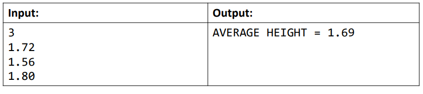

## Vetores:

#### Pequeno projeto para estudo de Vetores com Java.

#### Vetores:

• Em programação, "vetor" é o nome dado a arranjos unidimensionais
• Arranjo (array) é uma estrutura de dados: • Homogênea (dados do mesmo tipo)
• Ordenada (elementos acessados por meio de posições)
• Alocada de uma vez só, em um bloco contíguo de memória

#### • Vantagens:

• Acesso imediato aos elementos pela sua posição

#### • Desvantagens:

• Tamanho fixo
• Dificuldade para se realizar inserções e deleções:

- ##### Problema exemplo 1
- Fazer um programa para ler um número inteiro N e a altura de N
  pessoas. Armazene as N alturas em um vetor. Em seguida, mostrar a
  altura média dessas pessoas.

